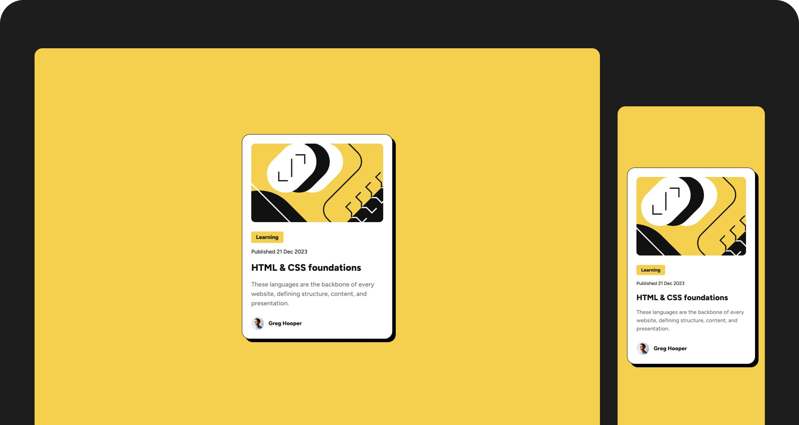

# Frontend Mentor - Blog preview card solution

This is a solution to the [Blog preview card challenge on Frontend Mentor](https://www.frontendmentor.io/challenges/blog-preview-card-ckPaj01IcS). Frontend Mentor challenges help you improve your coding skills by building realistic projects. 

## Screenshot

### Links

- Solution URL: [Live Site](https://mateusdmc.github.io/fm-blog-preview-card/)

## My process

### Built with

- Semantic HTML5
- Flexbox
- Mobile-first
- [Tailwind CSS](https://tailwindcss.com/) - CSS framework
